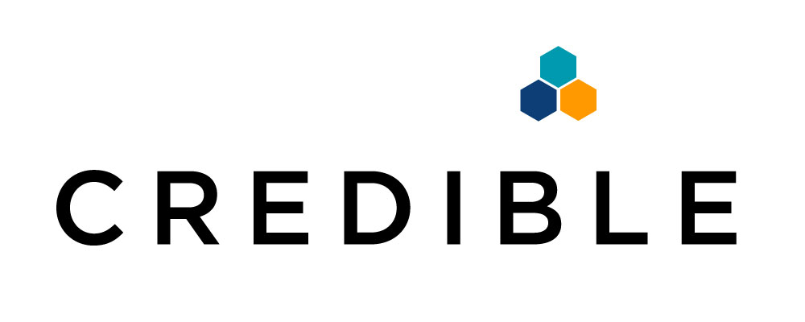

## About Us

Hello and welcome to **Credible**, a easy to use and secure tool built for lawyers to manage their continuing legal education (CLE) requirements.

Please visit https://staycredible.com/ for more information about Credible.

## Who we care about

We care about lawyers and accreditors. Credible uses **Integra Ledger's Permissioned Blockchain Technology** to service the entire workflow when it comes to creating and managing CLEs. Accreditors can add a CLE onto the blockchain, which are encrypted. Lawyers can obtain all their CLEs from the blockchain and decrypt the information if they have the right key. As an added benefit, lawyers can also keep track of the progress of their requirements. The entire process is secure and reliable at all stages.

## Who we are

We are lawyers and developers who have a vision in merging technology and law. Keeping track of CLEs is an essential part of any lawyer's career and we are seeking to make that process much simpler.

## Demo

#### Accreditors

Accreditors can fill out a simple form which adds an encrypted CLE onto Integra Ledger's blockchain.

#### Lawyer

Lawyers can see all their CLEs which are retrieved from Integra Ledger's blockchain.

**Credible is Powered by Integra**

GitHub: https://github.com/IntegraLedger  
Website: http://integraledger.com/

## Special thanks to

[John Scrudato](https://www.linkedin.com/in/john-scrudato/)  
[Ryan Kutter](https://www.linkedin.com/in/ryan-kutter-12152b91/)  
[Stephanie Spangler](https://www.linkedin.com/in/stephaniespangler/)  
[Martin Hui](https://www.linkedin.com/in/martinhui/)  
[Christian Lang](https://www.linkedin.com/in/christianllang/)  
[Luke Espina](https://www.linkedin.com/in/luke-espina/)  
[Sunny Wong](https://www.linkedin.com/in/sunny-gy-wong/)  
[Paul Alvord](https://www.linkedin.com/in/paulalvord/)
